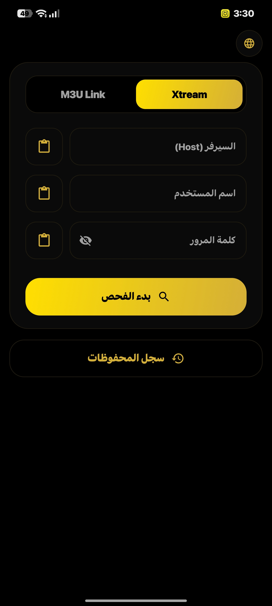
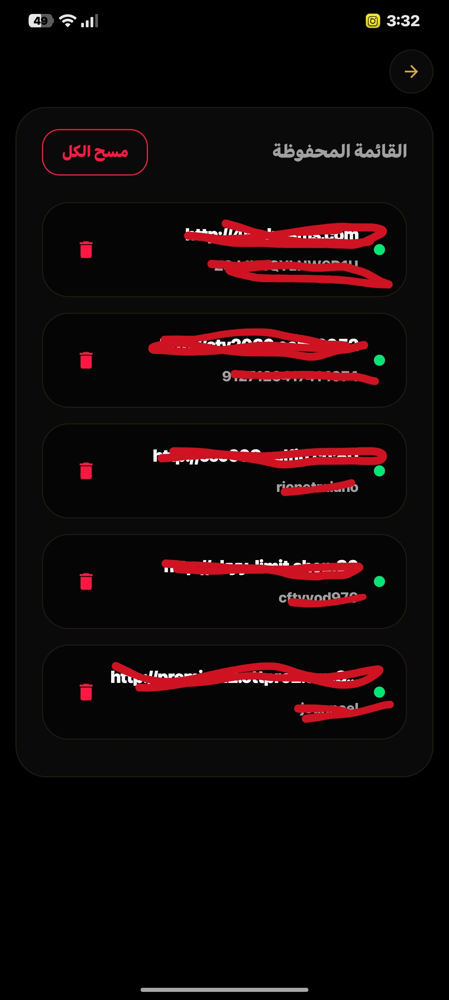
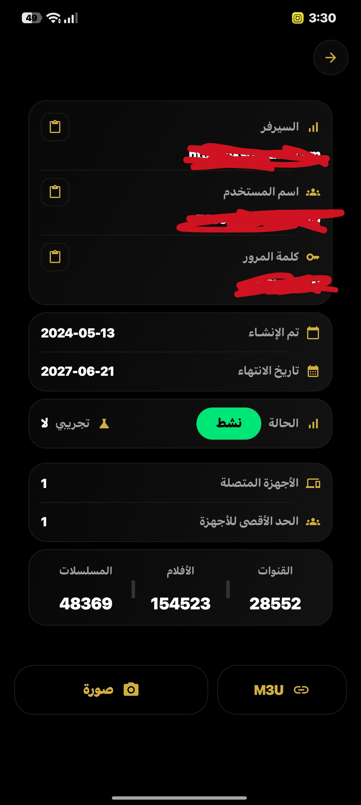

# الحصان الفاحص — AlHosan Checker

تطبيق أندرويد احترافي لفحص اشتراكات **Xtream Codes** و **روابط M3U** بسرعة ودقة، مع واجهة عربية/إنجليزية أنيقة.
[](https://developer.android.com)
[](https://kotlinlang.org)
[]     (https://developer.android.com/jetpack/compose)

---

## 🖼️ لقطات الشاشة

<p align="center">
  
  
  
  
</p>

---

## ✨ المميزات الرئيسية

- **فحص اشتراكات Xtream** مباشرة (حالة الاشتراك، تاريخ الانتهاء، الأجهزة المتصلة، عدد القنوات/الأفلام/المسلسلات)
- **دعم كامل لروابط M3U** (استخراج تلقائي للبيانات أو حساب عدد القنوات)
- **تصدير النتيجة كصورة PNG** (للمشاركة أو الحفظ)
- **إنشاء رابط M3U** جاهز للنسخ
- **سجل محفوظات** (حفظ + استرجاع + حذف)
- **واجهة عربية كاملة** مع دعم RTL
- **تبديل اللغة** في أي لحظة
- **شاشة بداية فورية** (Zero-delay splash)
- **تشخيص أخطاء دقيق** (DNS، SSL، مهلة، بيانات خاطئة...)

---

## 🛠️ التقنيات المستخدمة

| الطبقة          | التقنية                          | الوصف |
|----------------|----------------------------------|------|
| **UI**         | Jetpack Compose + Material 3    | واجهة حديثة وسريعة |
| **Networking** | OkHttp 4 + Kotlin Coroutines    | الطريقة الرئيسية (مستقرة) |
| **Fallback**   | Rust (اختياري)                  | معالجة ثقيلة عبر JNI (قيد التطوير) |
| **Data**       | kotlinx.serialization           | JSON سريع وآمن |
| **Images**     | Coil                            | تحميل الصور |

> **ملاحظة**: التطبيق يعمل **بشكل كامل** بدون مكتبة Rust. الـ Rust حالياً اختياري ويُستخدم كـ fallback للأداء العالي.

---

## 📱 كيفية الاستخدام

1. حمل آخر إصدار من [Releases](https://github.com/se6or/al-hosan-checker/releases)
2. فعّل "تثبيت من مصادر غير معروفة"
3. افتح التطبيق وأدخل بيانات الاشتراك أو رابط M3U
4. اضغط **بدء الفحص**

---

## 🔧 البناء من المصدر (للمطورين)

### المتطلبات
- Android Studio Hedgehog أو أحدث
- JDK 17
- Android SDK + NDK (اختياري لـ Rust)

### خطوات البناء (بدون Rust - موصى به)

```bash
./gradlew assembleRelease
```

سيتم إنشاء الـ APK في:
```
app/build/outputs/apk/release/
```

### بناء Rust (اختياري - للأداء المتقدم)

```bash
# 1. تثبيت الأهداف
rustup target add aarch64-linux-android armv7-linux-androideabi x86_64-linux-android

# 2. تثبيت cargo-ndk
cargo install cargo-ndk

# 3. بناء المكتبة
cd rust
export ANDROID_NDK_HOME=$ANDROID_HOME/ndk/27.0.12077973
./build_android.sh
```

ثم أعد بناء التطبيق.

---

## 📁 هيكل المشروع

```
al-hosan-checker/
├── app/
│   ├── src/main/java/com/alhosan/checker/
│   │   ├── ui/               # الشاشات (Login, Result, History...)
│   │   ├── viewmodel/
│   │   ├── data/repository/  # OkHttp + منطق الفحص
│   │   ├── bridge/           # RustBridge (اختياري)
│   │   └── util/
│   └── src/main/res/
├── rust/                     # (اختياري) الكود الأصلي
│   └── src/
├── .github/workflows/
│   └── build.yml             # بناء + إصدار تلقائي
└── README.md
```

---

## 📋 المتطلبات

- Android 8.0 (API 26) أو أحدث
- اتصال بالإنترنت

---

## 📜 الرخصة

هذا المشروع مفتوح المصدر للاستخدام الشخصي والتعليمي.

---

## 🤝 المساهمة

المساهمات مرحب بها! يمكنك فتح Issue أو Pull Request.

---

**صُنع بحب ❤️ لمجتمع IPTV العربي**
