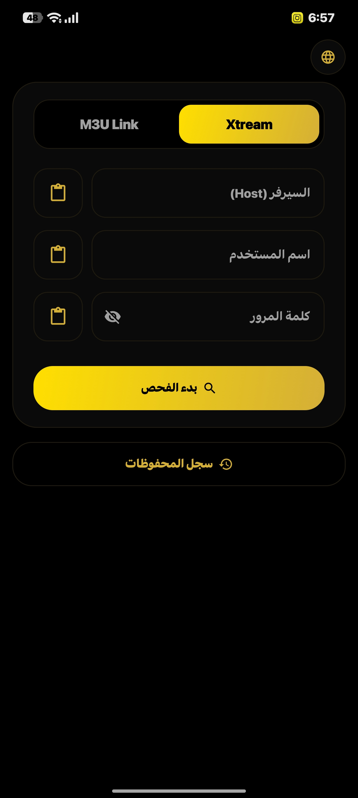
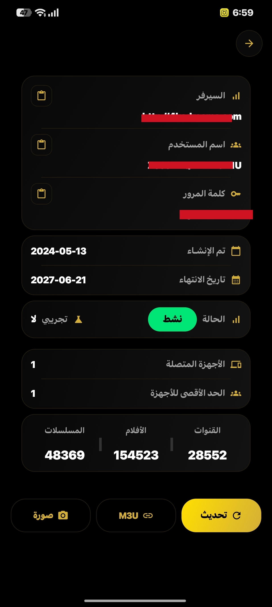
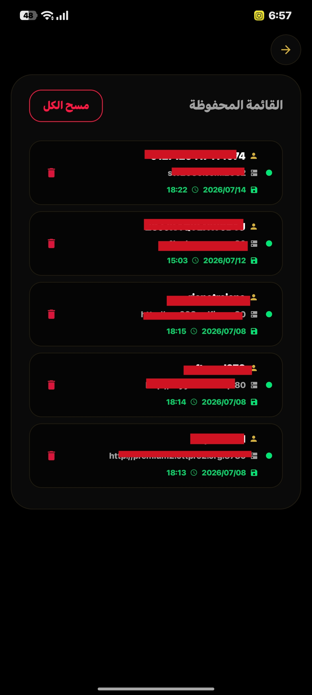

<div align="center">


# الحصان الفاحص — AlHosan Checker

تطبيق أندرويد احترافي لفحص اشتراكات **Xtream Codes** و **روابط M3U** بسرعة ودقة، مع واجهة عربية/إنجليزية أنيقة.

[](https://developer.android.com)
[](https://kotlinlang.org)
[](https://developer.android.com/jetpack/compose)
[](https://github.com/se6or/al-hosan-checker/stargazers)
[](https://github.com/se6or/al-hosan-checker/releases)

</div>

---

## 🖼️ لقطات الشاشة

<table>
  <tr>
    <td align="center"><b>شاشة تسجيل الدخول (M3U)</b></td>
    <td align="center"><b>شاشة تسجيل الدخول (Xtream)</b></td>
    <td align="center"><b>جارِ الفحص</b></td>
    <td align="center"><b>شاشة النتيجة</b></td>
    <td align="center"><b>سجل المحفوظات</b></td>
  </tr>
  <tr>
    <td></td>
    <td></td>
    <td></td>
    <td></td>
    <td></td>
  </tr>
</table>

---

## ✨ المميزات الرئيسية

- **فحص اشتراكات Xtream** مباشرة (حالة الاشتراك، تاريخ الانتهاء، الأجهزة المتصلة، عدد القنوات/الأفلام/المسلسلات)
- **دعم كامل لروابط M3U** (استخراج تلقائي للبيانات أو حساب عدد القنوات)
- **تصدير النتيجة كصورة PNG** (للمشاركة أو الحفظ)
- **إنشاء رابط M3U** جاهز للنسخ
- **سجل محفوظات** (حفظ + استرجاع + حذف)
- **تحديث تلقائي داخل التطبيق** — يتحقق من GitHub Releases ويحمّل ويثبّت أحدث نسخة بدون الحاجة لمتجر
- **واجهة عربية كاملة** مع دعم RTL
- **تبديل اللغة** في أي لحظة (عربي/إنجليزي)
- **شاشة بداية فورية** (Zero-delay splash)
- **تشخيص أخطاء دقيق** (DNS، SSL، مهلة، بيانات خاطئة...)
- **نواة Rust اختيارية** عبر JNI لمعالجة أسرع (فحص Xtream، تحليل M3U، فلترة القنوات) — مع fallback تلقائي لـ Kotlin/OkHttp لو المكتبة غير متوفرة

---

## 🛠️ التقنيات المستخدمة

| الطبقة          | التقنية                          | الوصف |
|----------------|----------------------------------|------|
| **UI**         | Jetpack Compose + Material 3    | واجهة حديثة وسريعة |
| **Networking** | OkHttp 4 + Kotlin Coroutines    | الطريقة الرئيسية (مستقرة) |
| **Native Core**| Rust (اختياري عبر JNI)          | فحص/تحليل أسرع لملفات ضخمة |
| **Data**       | kotlinx.serialization           | JSON سريع وآمن |
| **Images**     | Coil                            | تحميل الصور |
| **التحديثات**  | GitHub Releases API              | فحص + تحميل + تثبيت تلقائي داخل التطبيق |

---

## 📱 كيفية الاستخدام

1. حمل آخر إصدار من [Releases](https://github.com/se6or/al-hosan-checker/releases)
2. فعّل "تثبيت من مصادر غير معروفة" عند أول تثبيت
3. افتح التطبيق وأدخل بيانات الاشتراك (Xtream) أو رابط M3U
4. اضغط **بدء الفحص**

بعد كذا، التطبيق يتحقق تلقائياً من وجود إصدار أحدث على GitHub عند كل فتح، ويعرض لك تحديث بضغطة واحدة — بدون حاجة لتنزيل يدوي.

---

## 📁 هيكل المشروع

```
al-hosan-checker/
├── app/
│   ├── src/main/java/com/alhosan/checker/
│   │   ├── ui/
│   │   │   ├── screens/       # Login, Result, History, Splash
│   │   │   ├── components/    # عناصر واجهة مشتركة + UpdateDialog
│   │   │   └── i18n/          # نصوص عربي/إنجليزي
│   │   ├── viewmodel/         # CheckerViewModel
│   │   ├── data/
│   │   │   ├── model/         # Subscription, HistoryItem...
│   │   │   └── repository/    # CheckerRepository (منطق الفحص)
│   │   ├── bridge/            # RustBridge (JNI)
│   │   └── util/              # AppUpdater, ImageExporter...
│   └── src/main/res/
├── rust/                      # نواة Rust الاختيارية
├── screenshots/
├── .github/workflows/
│   └── build.yml              # بناء + توقيع + رفع إصدار (يدوي)
└── README.md
```

---

## 🔄 نظام التحديث التلقائي

التطبيق يفحص GitHub Releases تلقائياً عند فتحه، ويقارن رقم الإصدار المثبت بآخر إصدار منشور. لو وجد إصدار أحدث:

1. يعرض نافذة تحديث داخل التطبيق (بدون الخروج منه)
2. يحمّل ملف APK من الـ Release مباشرة
3. يثبّته تلقائياً بعد موافقة المستخدم

**للمطورين:** كل إصدار جديد يتطلب:
1. رفع `versionCode` و `versionName` في `app/build.gradle.kts`
2. تشغيل الـ workflow يدوياً من تبويب **Actions**
3. الـ workflow يبني APK موقّع وينشره على Releases تلقائياً

---

## 📋 المتطلبات

- Android 8.0 (API 26) أو أحدث
- اتصال بالإنترنت

---

## 📜 الرخصة

هذا المشروع مفتوح المصدر للاستخدام الشخصي والتعليمي.

---

## 🤝 المساهمة

المساهمات مرحب بها! يمكنك فتح Issue أو Pull Request.

---

## 👥 المساهمون

<table>
  <tr>
    <td align="center">
      <a href="https://github.com/se6or">
        <br/>
        <b>se6or</b>
      </a>
    </td>
    <td align="center">
      <a href="https://chat.z.ai/">
        <br/>
        <b>Super Z</b>
      </a>
    </td>
    <td align="center">
      <a href="https://arena.ai/agent">
        <br/>
        <b>lm Arena</b>
      </a>
    </td>
    <td align="center">
      <a href="https://claude.ai/new">
        <br/>
        <b>Claude</b>
      </a>
    </td>
  </tr>
</table>

---

**صُنع بحب ❤️ لمجتمع IPTV العربي**

